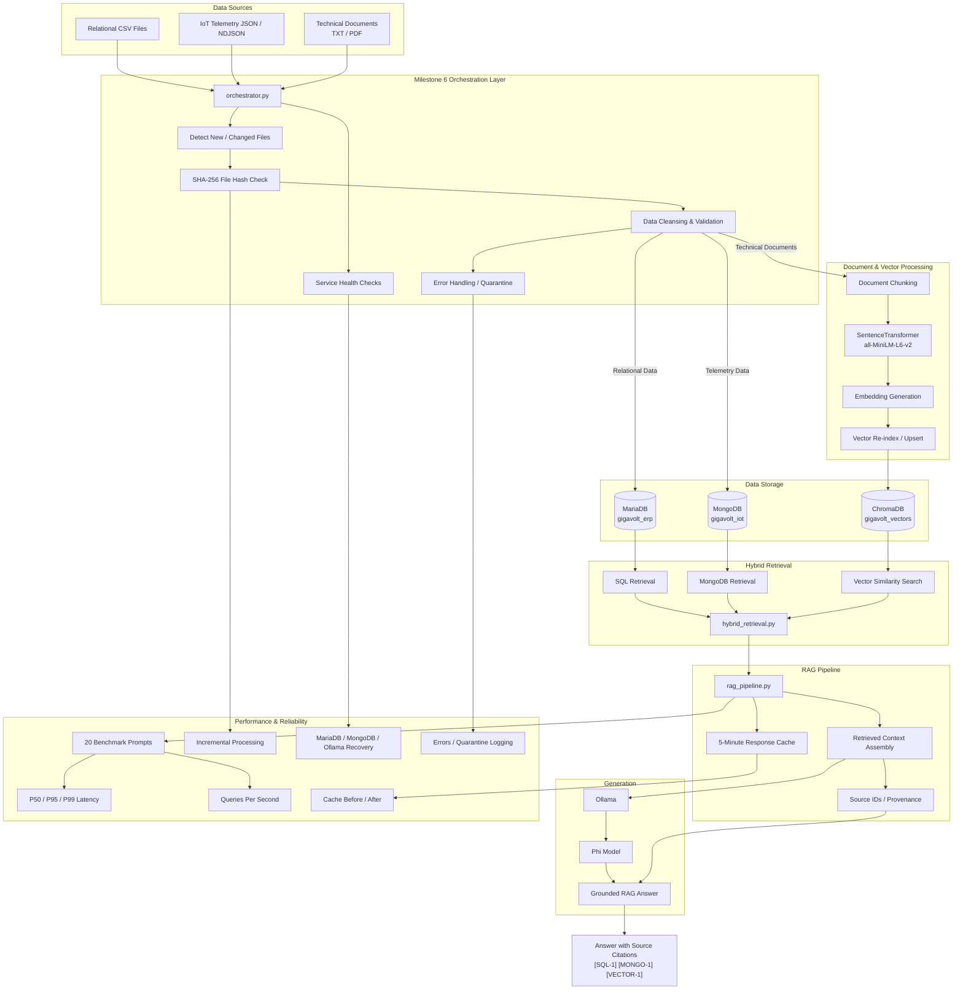

# System Architecture

The architecture flows from new data ingestion through automated routing, storage, hybrid retrieval, RAG generation, provenance, and benchmarking.

```mermaid
flowchart TD
    subgraph A["Data Sources"]
        A1["Relational CSV Files"]
        A2["IoT Telemetry JSON / NDJSON"]
        A3["Technical Documents<br/>TXT / PDF"]
    end
    subgraph B["Milestone 6 Orchestration Layer"]
        B1["orchestrator.py"]
        B2["Detect New / Changed Files"]
        B3["SHA-256 File Hash Check"]
        B4["Data Cleansing & Validation"]
        B5["Error Handling / Quarantine"]
        B6["Service Health Checks"]
    end
    A1 --> B1
    A2 --> B1
    A3 --> B1
    B1 --> B2 --> B3 --> B4 --> B5
    B1 --> B6
    subgraph C["Data Storage"]
        C1[("MariaDB<br/>gigavolt_erp")]
        C2[("MongoDB<br/>gigavolt_iot")]
        C3[("ChromaDB<br/>gigavolt_vectors")]
    end
    B4 -->|Relational Data| C1
    B4 -->|Telemetry Data| C2
    subgraph D["Document & Vector Processing"]
        D1["Document Chunking"] --> D2["SentenceTransformer<br/>all-MiniLM-L6-v2"] --> D3["Embedding Generation"] --> D4["Vector Re-index / Upsert"]
    end
    B4 -->|Technical Documents| D1
    D4 --> C3
    subgraph E["Hybrid Retrieval"]
        E2["SQL Retrieval"] --> E1["hybrid_retrieval.py"]
        E3["MongoDB Retrieval"] --> E1
        E4["Vector Similarity Search"] --> E1
    end
    C1 --> E2
    C2 --> E3
    C3 --> E4
    subgraph F["RAG Pipeline"]
        F1["rag_pipeline.py"] --> F2["Retrieved Context Assembly"] --> F3["Source IDs / Provenance"]
        F1 --> F4["5-Minute Response Cache"]
    end
    E1 --> F1
    subgraph G["Generation"]
        G1["Ollama"] --> G2["Phi Model"] --> G3["Grounded RAG Answer"]
    end
    F2 --> G1
    F3 --> G3
    G3 --> H["Answer with Source Citations<br/>[SQL-1] [MONGO-1] [VECTOR-1]"]
    subgraph I["Performance & Reliability"]
        I1["20 Benchmark Prompts"] --> I2["P50 / P95 / P99 Latency"]
        I1 --> I3["Queries Per Second"]
        I4["Cache Before / After"]
        I5["Incremental Processing"]
        I6["MariaDB / MongoDB / Ollama Recovery"]
        I7["Errors / Quarantine Logging"]
    end
    F1 --> I1
    F4 --> I4
    B3 --> I5
    B6 --> I6
    B5 --> I7
```
